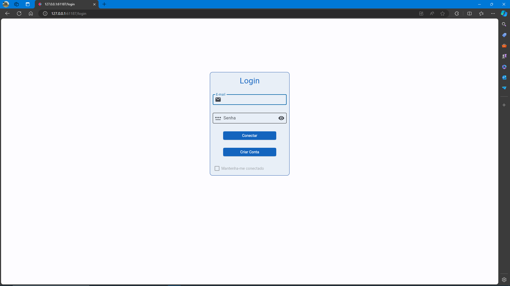
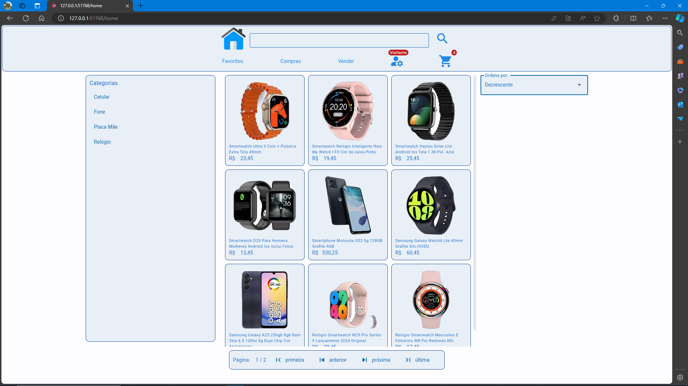
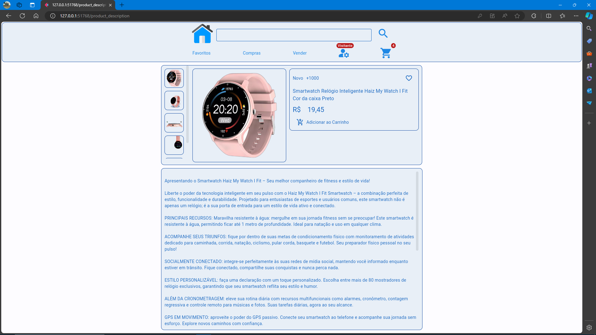
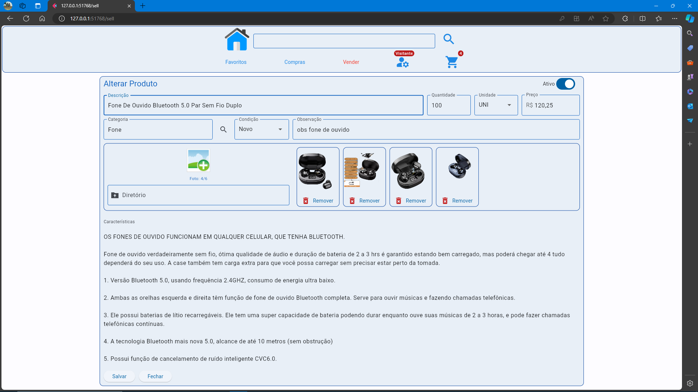
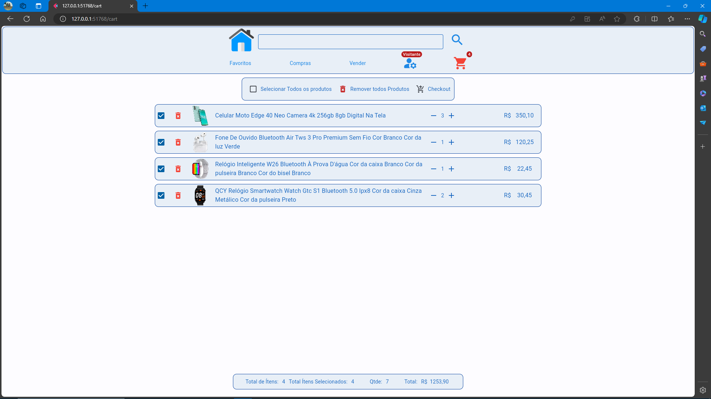
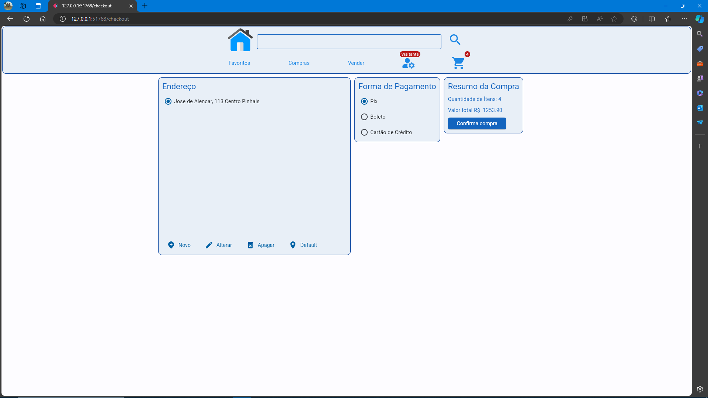

# Basico e-commerce

[](https://www.python.org)
[](https://flet.dev/)
[](https://www.sqlite.org/index.html)
[](http://opensource.org/licenses/MIT)

## Instalação

```sh
pip install -r requeriments.txt
```

## Telas

 Login

 
Home


Produto


Vender


Carrinho


Checkout

